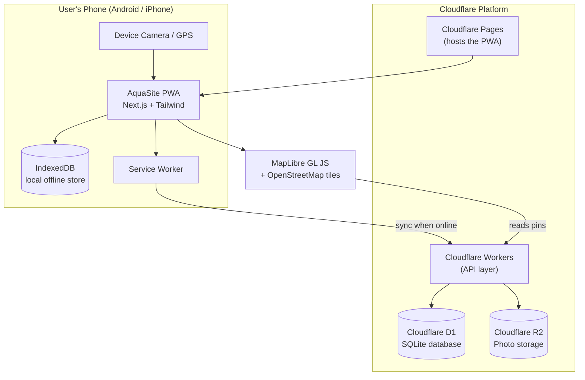
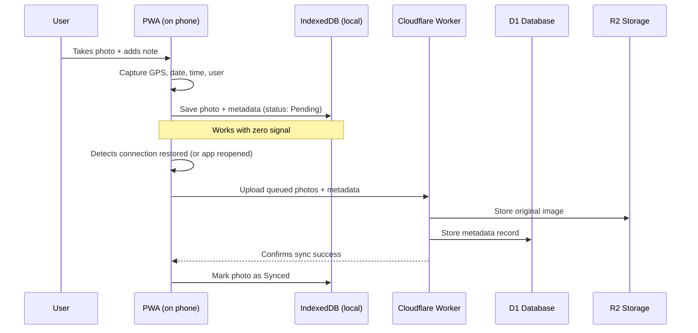
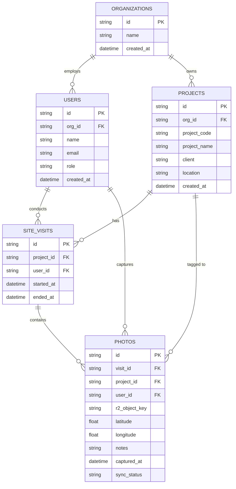
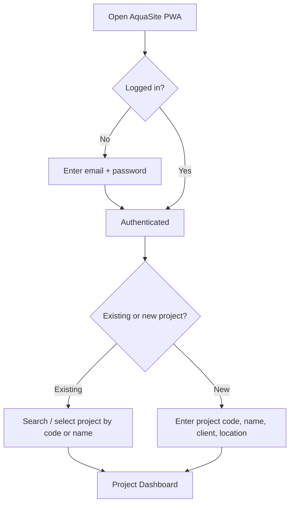
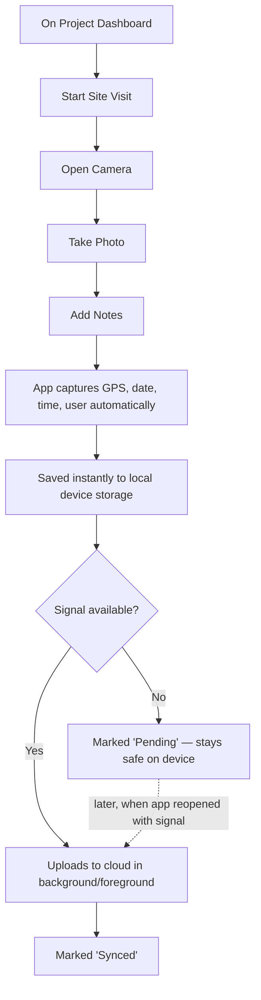
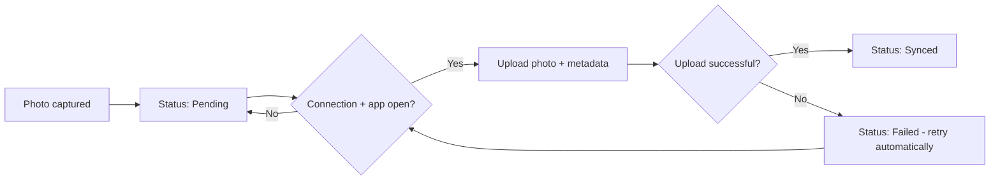
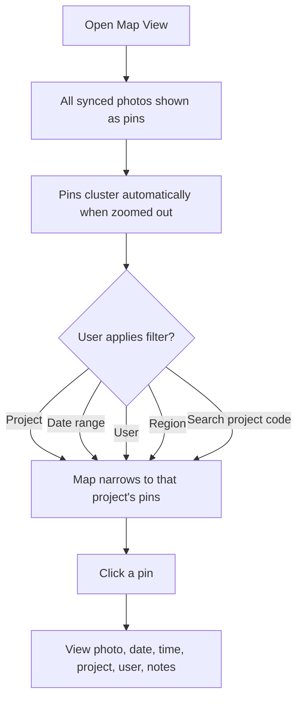
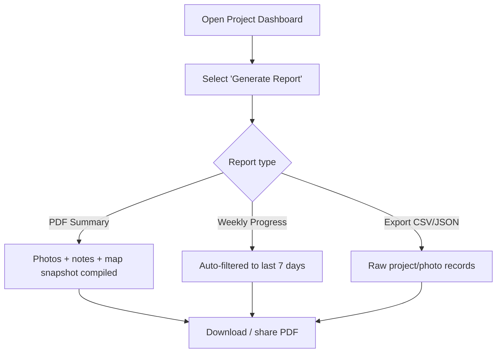

# AquaSite — Product Specification & System Architecture

**Prepared for:** Toby Loveday
**Document type:** Product Specification / Technical Architecture
**Version:** 1.0 — Draft for review
**Date:** July 2026

---

## 1. Executive Summary

AquaSite is a Progressive Web App (PWA) that lets engineers, inspectors, site supervisors and construction personnel capture geotagged site progress photos in the field — including in areas with poor or no signal — and have them automatically organised against civil engineering, water, wastewater, highways and infrastructure projects.

Photos, notes, GPS location, timestamps and user details are captured on-device, stored locally first, and synchronised to a cloud backend once connectivity returns. All data is visualised on an interactive UK map and structured into per-project dashboards, with PDF and export reporting.

The stack is built entirely on Cloudflare's platform (Pages, Workers, D1, R2) specifically because it has a generous free tier and scales cost gradually — appropriate for a small startup budget.

A PWA (rather than a native App Store app) was chosen because it can be installed directly from a browser on both Android and iPhone with no app store approval process, no $99/year Apple developer fee, and one shared codebase.

---

## 2. Product Specification

### 2.1 Vision

Give field teams in the UK water and infrastructure sector a fast, reliable, purpose-built way to document site progress — replacing scattered WhatsApp photos, camera rolls, and paper site diaries with one structured, searchable, mapped record per project.

### 2.2 User Personas

| Persona | Role | Primary need |
|---|---|---|
| **Site Engineer / Supervisor** | Captures daily progress photos | Fast capture, works offline, minimal typing |
| **Inspector** | Periodic site visits, compliance checks | Structured notes, photo evidence, timestamps |
| **Project Manager** | Oversees multiple projects | Dashboard view, reports, map overview |
| **Admin** | Manages users, projects, org settings | User management, project setup |
| *(Future)* Client / Stakeholder | Read-only progress viewer | Simplified report view only |

### 2.3 Functional Requirements

**Authentication & Access**
- Secure login (email + password, or magic link)
- Role-based access (Admin, Manager, Field User — future: Client)
- Session persists across app restarts

**Project Management**
- Select an existing project or create a new one
- Required fields: Project code, Project name, Client, Location
- Project list searchable by project code or name

**Site Visits**
- "Start a site visit" against a selected project
- A visit groups together all photos/notes captured in that session
- Visit automatically records start time, user, and (once synced) all photos taken

**Photo Capture**
- Native camera capture via the device camera (no app store camera permissions needed — handled by the browser)
- Add free-text notes/comments per photo
- Automatic capture of: date, time, GPS coordinates, user name, project code/name

**Mapping**
- Every synced photo appears as a pin on an interactive UK map
- Pins cluster automatically when zoomed out
- Clicking a pin shows photo, date, time, project, user, notes
- Filters: project, date range, user, region
- Search by project code

**Project Dashboard**
- Project code, name, client, location
- Photo gallery (grid view)
- Interactive map scoped to that project
- Timeline of photos (chronological)
- Count of site visits and photos captured

**Reporting**
- Generate PDF report (project summary, photos, notes, map snapshot)
- Export project records (CSV/JSON)
- Export photo logs
- Export map view (image/PDF snapshot)
- Weekly auto-generated progress report

**Offline Behaviour**
- Photos, GPS and notes stored locally the instant they're captured — never lost if signal drops
- Automatic sync when connection returns
- Clear visual indicator per photo: *Pending / Syncing / Synced / Failed*

### 2.4 Non-Functional Requirements

- **Offline-first**: the app must be fully usable for capture with zero signal; sync is opportunistic, not required.
- **Cross-platform install**: installable on Android (Chrome) and iOS (Safari "Add to Home Screen") with no App Store submission.
- **Security & data protection**: photos may contain sensitive infrastructure/site data — access controlled by project and role; UK GDPR-compliant data handling (data residency, right to erasure, encrypted storage in transit and at rest).
- **Cost efficiency**: architecture must stay within or close to Cloudflare's free tiers at small scale (see Section 6).
- **Performance**: photo capture-to-save must feel instant (<1s), regardless of connectivity.

### 2.5 Important Real-World Constraint: iOS Background Sync

This is worth understanding early, because it genuinely shapes the design:

- **Android (Chrome)** supports the Background Sync API — the browser can sync queued photos even if the app isn't open, once signal returns.
- **iOS (Safari)** does **not** support Background Sync. An iPhone user must have the app open (in foreground) for sync to run.

**Mitigation built into the design:** sync is triggered automatically whenever (a) the app is opened, (b) the app regains focus, and (c) the device's `online` event fires while the app is open — plus a manual "Sync Now" button. This is a normal, well-understood workaround and doesn't compromise the offline-first promise; it just means "sync happens next time you open the app with signal," not silently in the background on iPhone.

### 2.6 Out of Scope for MVP (Future Roadmap — see Section 7)

Asset inspections, defect management, snagging lists, QR asset tracking, AI-generated reports, voice-to-text, photo markup/annotation drawing, team management, multi-company support, water utility asset management.

---

## 3. System Architecture

### 3.1 High-Level Architecture

### 3.2 Component Breakdown

| Layer | Technology | Purpose |
|---|---|---|
| Frontend | **Next.js** (App Router) + **TypeScript** + **Tailwind CSS** | The app itself — installable, responsive UI |
| PWA/Offline shell | Service Worker (via Serwist or next-pwa) | Caches the app so it loads with no signal |
| Local data store | **IndexedDB** (via Dexie.js) | Stores photos, notes, GPS as blobs/records before sync |
| Hosting | **Cloudflare Pages** | Serves the PWA globally, free tier generous |
| API | **Cloudflare Workers** | Handles auth, project CRUD, photo upload, sync, reports |
| Database | **Cloudflare D1** | Stores projects, users, visits, photo metadata |
| File storage | **Cloudflare R2** | Stores the actual photo image files (no egress fees) |
| Mapping | **MapLibre GL JS** + OpenStreetMap + Supercluster | Free, open-source map + clustering (avoids Mapbox costs) |
| Auth | **Lucia Auth** or **Auth.js**, backed by D1 | Lightweight, no per-user SaaS fees |
| PDF generation | Worker-side (`@react-pdf/renderer` or `pdf-lib`) | Builds project/weekly PDF reports |

### 3.3 The Offline → Sync Flow

### 3.4 Why this stack keeps costs low

- Cloudflare Pages: free hosting, no bandwidth charges
- Workers: 100,000 free requests/day on the free plan
- D1: generous free row-read/write allowance, pay-as-you-grow after
- R2: **no egress fees** (unlike AWS S3) — big saving since photos get viewed often
- OpenStreetMap + MapLibre: completely free map tiles vs. paid Mapbox/Google Maps
- No native app store fees, no per-seat SaaS auth costs

---

## 4. Database Design

### 4.1 Entity Relationship Diagram

### 4.2 Table Definitions (D1 / SQLite)

**organizations**
| Column | Type | Notes |
|---|---|---|
| id | TEXT (UUID) | Primary key |
| name | TEXT | |
| created_at | DATETIME | |

**users**
| Column | Type | Notes |
|---|---|---|
| id | TEXT (UUID) | Primary key |
| org_id | TEXT | FK → organizations.id |
| name | TEXT | |
| email | TEXT | Unique |
| password_hash | TEXT | For Lucia/Auth.js |
| role | TEXT | `admin` \| `manager` \| `field_user` |
| created_at | DATETIME | |

**projects**
| Column | Type | Notes |
|---|---|---|
| id | TEXT (UUID) | Primary key |
| org_id | TEXT | FK → organizations.id |
| project_code | TEXT | Unique, searchable |
| project_name | TEXT | |
| client | TEXT | |
| location | TEXT | Free text, e.g. "Leeds, UK" |
| created_at | DATETIME | |

**site_visits**
| Column | Type | Notes |
|---|---|---|
| id | TEXT (UUID) | Primary key |
| project_id | TEXT | FK → projects.id |
| user_id | TEXT | FK → users.id |
| started_at | DATETIME | |
| ended_at | DATETIME | Nullable while in progress |

**photos**
| Column | Type | Notes |
|---|---|---|
| id | TEXT (UUID) | Primary key — generated **on-device** so it works offline |
| visit_id | TEXT | FK → site_visits.id |
| project_id | TEXT | FK → projects.id (denormalised for fast filtering) |
| user_id | TEXT | FK → users.id |
| r2_object_key | TEXT | Path to image in R2 |
| latitude | REAL | |
| longitude | REAL | |
| notes | TEXT | |
| captured_at | DATETIME | Set on-device at capture time |
| synced_at | DATETIME | Nullable until synced |
| sync_status | TEXT | `pending` \| `synced` \| `failed` |

> **Design note:** Photo IDs are generated as UUIDs *on the phone*, not by the server. This is essential for offline-first apps — it means a photo taken with zero signal already has a permanent, unique identity and can be safely uploaded later without ID collisions.

---

## 5. User Journeys

### 5.1 Login & Project Selection

### 5.2 Site Visit & Offline Photo Capture

### 5.3 Sync & Status Indication

### 5.4 Viewing the Map & Filtering

### 5.5 Generating a Report

---

## 6. Roadmap: MVP → Future Features

| Phase | Scope |
|---|---|
| **MVP (Phase 1)** | Login, project create/select, site visits, offline photo capture with notes + metadata, sync, basic map with pins/clustering, project dashboard, PDF export |
| **Phase 2** | Advanced filtering, weekly auto-reports, export formats, multi-user roles/permissions polish |
| **Phase 3** | Asset inspections, defect management, snagging lists |
| **Phase 4** | QR code asset tracking, drawing/markup on photos, voice-to-text notes |
| **Phase 5** | AI-generated site reports, multi-company support, team management, water utility asset management module |

The database schema above already anticipates this — `organizations` supports multi-company from day one, and photos/visits are structured so an "inspections" or "defects" table can be added later without reworking the core model.

---

## 7. Rough Cost Expectations (Small Startup Scale)

| Service | Free tier | Likely monthly cost at early scale |
|---|---|---|
| Cloudflare Pages | Unlimited requests, generous builds | £0 |
| Cloudflare Workers | 100,000 requests/day free | £0 |
| Cloudflare D1 | 5GB storage, 25M row reads/day free | £0 |
| Cloudflare R2 | 10GB storage free, no egress fees | £0–£5 (once past 10GB of photos) |
| Domain name | — | ~£1/month (annual reg.) |
| **Total estimate** | | **£0–£10/month** for the first several hundred site visits |

Costs scale gradually and predictably as usage grows — there's no scenario where a spike in photo uploads produces a nasty surprise bill, which matters a lot for a bootstrapped project.

---

## 8. Recommended Next Steps

Since you're starting without a development background, here's a sensible order of operations:

1. **Set up the empty GitHub repo** with a basic Next.js + TypeScript + Tailwind starter (this can be scaffolded automatically).
2. **Build the MVP in this order**: Auth → Project CRUD → Site visit + photo capture (online only first) → Local offline storage → Map view → PDF report.
3. **Deploy early and often** to Cloudflare Pages so you can test on your own phone (both Android and iPhone) throughout — PWA quirks (especially on iOS) are much easier to catch early.
4. Consider using **Claude Code** to actually write and scaffold this codebase against this specification — it can work directly in your repo, run builds, and iterate, which suits a non-developer working with an AI pair-programmer well.

---

*End of document.*
